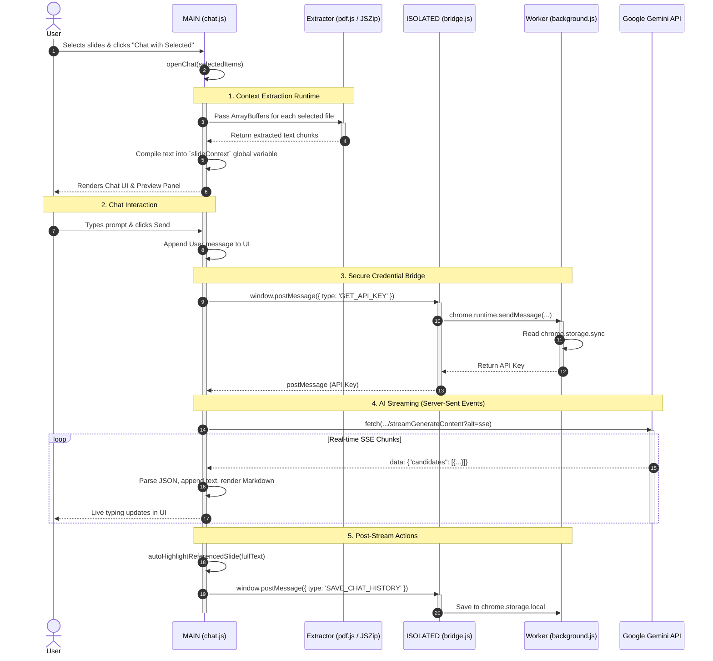

# PESUmate AI Chat Architecture

This document details the internal architecture and data flow of the PESUmate AI Chat feature (`v2.0.0`), mapping out the interaction between the injected UI, file extractors, Chrome APIs, and the Gemini AI server.

## Execution Environments

Because PESUmate injects highly interactive UI elements directly into the `pesuacademy.com` webpage, the extension spans multiple execution contexts to balance UX and security:

1. **MAIN World (`chat.js`, `content.js`)**: Runs directly in the context of the webpage. This allows seamless manipulation of the DOM, capturing user clicks, and rendering the chat overlay and native slide previews.
2. **ISOLATED World (`bridge.js`)**: A Chrome Extension content script running in a protected scope. It cannot be tampered with by the host webpage but has access to Chrome Extension APIs (like `chrome.runtime.sendMessage`).
3. **Service Worker (`background.js`)**: The background process that handles secure requests such as reading API keys from `chrome.storage.sync` and managing local chat history.

## Full Workflow Diagram

Below is the sequence diagram illustrating the lifecycle of a chat session, from slide selection to the streaming AI response.

## Key Mechanisms

### Context Handling (`slideContext`)
When the chat is launched, `chat.js` loops through the selected items and immediately processes their raw file buffers into plain text using `pdf.js` for PDFs and `JSZip` for PPTX files (unzipping XML slides). 

This text is accumulated into a single global string variable, `slideContext`. Every time a request is made to the Gemini API, this `slideContext` is heavily prepended to the *very first* user message to ground the AI's understanding, alongside the `PESUMATE_SYSTEM_PROMPT`.

### The Security Bridge (`bridge.js`)
Scripts executing in the `MAIN` browser world do not have access to sensitive `chrome.*` APIs. To securely fetch the user's Gemini API key (stored via the extension's popup in `chrome.storage.sync`), `chat.js` broadcasts an event to the `window` object. `bridge.js` listens to this event, securely proxies the request to the extension's `background.js`, and posts the secret key back down. 

### Server-Sent Events (SSE) Processing
To achieve incredibly fast AI response times, the extension uses `fetch` with the `?alt=sse` query parameter directly from the `MAIN` World. 
A `TextDecoder` stream reader captures chunks of raw bytes as they arrive from Google's servers. The script searches for `data: ` prefixes, parses the JSON payload, and continuously rebuilds the Markdown UI bubble in real time.

### Chat History Management
Conversations are saved to `chrome.storage.local` indexed by the specific course unit (e.g., `chat_Unit 1`). This allows players to hop between different course units and resume contextual conversations exactly where they left off. The saving triggers autonomously after every completed stream generation.
